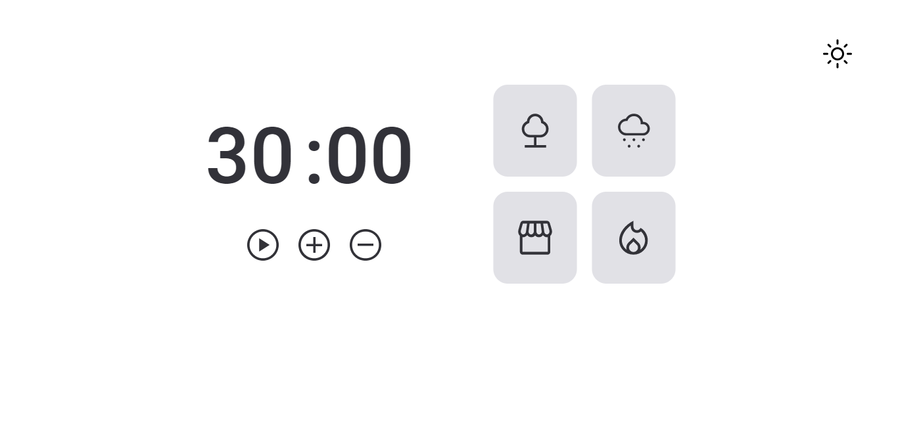

<h1 align="center"> CountDown </h1>

  <a href="#-tecnologias">Tecnologias</a>&nbsp;&nbsp;&nbsp;|&nbsp;&nbsp;&nbsp;
  <a href="#-projeto">Projeto</a>&nbsp;&nbsp;&nbsp;|&nbsp;&nbsp;&nbsp;
  <a href="#-layout">Layout</a>&nbsp;&nbsp;&nbsp;|&nbsp;&nbsp;&nbsp;
  <a href="#memo-licença">Licença</a>

  

 

  

## 🚀 Tecnologias

Esse projeto foi desenvolvido com as seguintes tecnologias:

<ul>
          <li style="align-items: center; font-size: 1.2rem"> HTML e  CSS</li>
          <li style="align-items: center; font-size: 1.2rem"> JavaScript</li>
          <li style="align-items: center; font-size: 1.2rem"> Git e  Github</li>
        </ul>

## 💻 Projeto

O pomodoro é um app que contribue na sua produtividade e foco, podendo utilizar temporizadores para organizar o tempo e cada atividade, além de sons predefinidos para maior concentração

## 🔖 Layout

Você pode visualizar o projeto através [DESSE LINK](https://nesdark.github.io/pomodoro/).

## :memo: Licença

Esse projeto está sob a licença MIT.

---

Feito com ♥ by Christian
